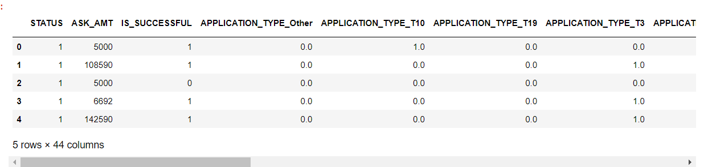
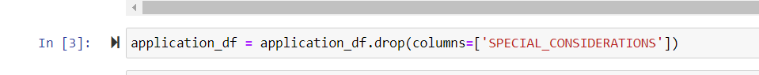
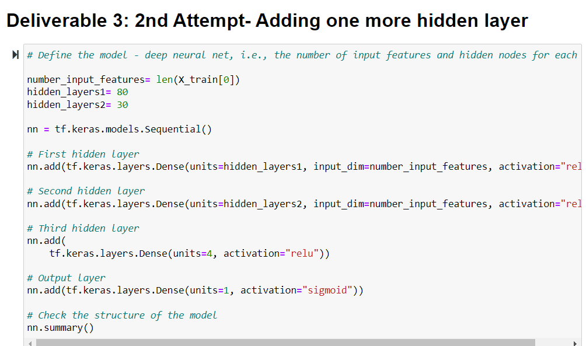
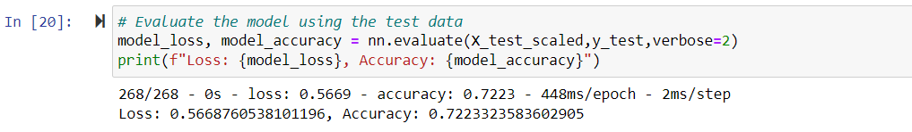
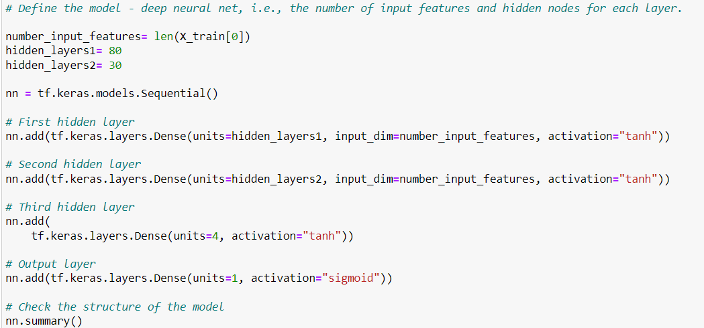
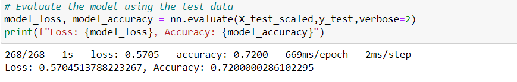
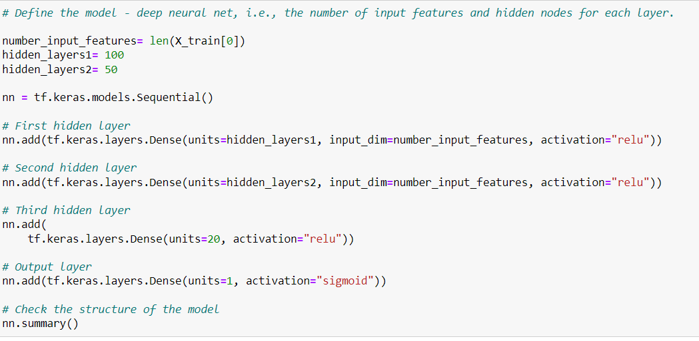

# Neural_Network_Charity_Analysis
  Neural_Network_Charity_Analysis

### Overview of the analysis: Explain the purpose of this analysis.
     Using machine learning and neural networks, features in the provided dataset will be leveraged to help Beks create a binary classifier that  predicts whether 
   applicants will be successful if funded by Alphabet Soup.

### Results: Using bulleted lists and images to support your answers, address the following questions.

#### Data Preprocessing
   Initial step was to drop 2 unnecessary columns "EIN" and "NAME" 

#### What variable(s) are considered the target(s) for your model?
   Target variable for this model was the "IS_SUCCESSFUL" column 

#### What variable(s) are considered to be the features for your model?
   APPLICATION_TYPE(Alphabet Soup application type)

   AFFILIATION(Affiliated sector of industry)

   CLASSIFICATION(Government organization classification)

   USE_CASE(Use case for funding)

   ORGANIZATION(Organization type)

   STATUS(Active status)

   INCOME_AMT(Income classification)

   SPECIAL_CONSIDERATIONS(Special consideration for application)

   ASK_AMT(Funding amount requested)

   
   Deliverable 1 Image:

    

#### What variable(s) are neither targets nor features, and should be removed from the input data?
      Many feature columns were later converted to "dummy" variables using the "one hot encoder" method from scikit-learn . That is the reason the number of input 
   features. Number of unique values from each column was calculated using the nunique() method which enabled us to bucket into "other" column (to reduce the number of dummy columns that would result when converting categorical variables to numerical format). A filtered list was created to only include values from the column which were not used much(Chosen value =500). In addition list one hot encoder was used for numerical format conversion needed for neural network models. There was an attempt made to improve performance by dropping 'SPECIAL_CONSIDERATIONS' column but did not help much.      
  
#### Compiling, Training, and Evaluating the Model

How many neurons, layers, and activation functions did you select for your neural network model, and why?
   Number of input features = 43
   Output = 1
   First Hidden Layer= 80(Double than the input)
   Second Hidden Layer = 30(Chosen to increase processing and limited the number to avoid overfitting)

   Both the hidden layers used the "relu" activation function and output layer used the "sigmoid function"
 
Were you able to achieve the target model performance?
   From this first neural network model design, accuracy was less than 75% which was expected based on the information in the module. There were multiple attempts made to improve and maximum that could be achieved was upto 72.23.

What steps did you take to try and increase model performance?

  First Attempt:

  Jupyter Notebook- AlphabetSoupCharity.ipynb

  One column was dropped.

  application_df = application_df.drop(columns=['SPECIAL_CONSIDERATIONS'])

  Results:
   
  

 Second Attempt:

  Jupyter Notebook- AlphabetSoupCharity_Optimization2.ipynb

  

  

 Third Attempt-Option 1
 Changed activation function to "tanh" and kept everything else the same(Neurons and hidden layers) 
 
  

    

  

 
 Third Attempt-Option 2
 Changed activation function to "relu" and increased neurons to 100 , 50 anf 20 for the 3 hidden layers 

  

  

### Summary: Summarize the overall results of the deep learning model. Include a recommendation for how a different model could solve this classification problem, and explain your recommendation.

     To summarize, deep neural network machine learning model produced a binary classifier in predicting whether loaning to a given applicant will produce successful 
   results. Accuracy never reached 75% even after 4 attempts of optimization. It would be recommended to try another new supervised learning classification model like
   ensemble-based random forest classifier.
 